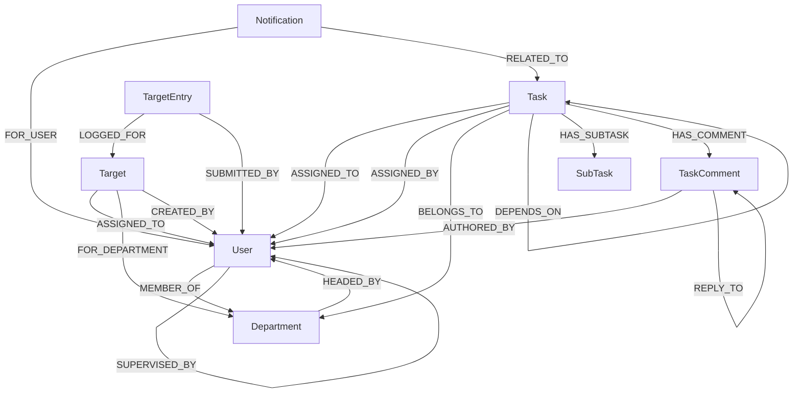

# TaskManager Pro (CognoDB Edition)

> **Enterprise Task & Team Orchestration Powered by Graph Intelligence**  
> *Built with NestJS, Next.js 16, and CognoDB (openCypher over Bolt Protocol).*

---

## Project Overview

**TaskManager Pro** is an enterprise-grade task and workforce management system engineered specifically for graph database architectures. Backed by **CognoDB**, it natively models organizational hierarchies, transitive task dependencies, departmental alignments, targets, and live performance metrics as first-class graph entities.

Traditional task managers struggle with recursive organizational structures and deep dependency chains. TaskManager Pro leverages CognoDB to provide instant multi-hop reporting traversals, real-time circular dependency detection, transitive blocker resolution, and dynamic on-read performance evaluations without recursive SQL queries or background cron jobs.

### Core Capabilities

- **Dependency Intelligence:** Define prerequisite task chains (`Task -[:DEPENDS_ON]-> Task`) with automated circular dependency prevention.
- **Transitive Blocker Detection:** Instantly inspect the entire upstream dependency tree blocking any given task.
- **Multi-Hop Reporting Chains:** Traverse arbitrary supervisor levels (`User -[:SUPERVISED_BY*1..10]-> User`) in a single query.
- **Live Performance Scoring:** Scores are derived dynamically on read directly from active graph paths (no stale background cache).
- **Target Tracking & Progress Entries:** Set individual and departmental goals with chronological milestone submissions.
- **Threaded Task Comments:** Contextual conversations on tasks supporting nested reply trees (`TaskComment -[:REPLY_TO]-> TaskComment`).
- **Interactive UI/UX:** Built with Next.js 16, Tailwind CSS v4, Framer Motion, and a 5-card animated Bento Grid showcase.

---

## Why a Graph Database?

A critical requirement of this project was choosing an application domain where a graph database genuinely excels over a relational database.

| Relational (SQL) Pain Point | CognoDB (Graph Database) Advantage |
|---|---|
| **Multi-Hop Reporting Hierarchies:** Finding an employee's full management line requires complex recursive Common Table Expressions (CTEs) or $N+1$ iterative database queries. | **Bounded Graph Traversal:** A single bounded Cypher expression `(u)-[:SUPERVISED_BY*1..10]->(m)` returns the entire chain ordered by depth in microseconds. |
| **Transitive Task Dependencies:** Identifying all upstream blockers across nested dependencies requires multi-table self-joins with manual loop prevention. | **Variable-Length Path Queries:** Direct pattern matching `(t)-[:DEPENDS_ON*1..20]->(b)` discovers all transitive blockers across arbitrary depths. |
| **Cycle & Deadlock Prevention:** Preventing circular dependencies (e.g. Task A $\rightarrow$ Task B $\rightarrow$ Task A) in SQL requires custom triggers or application-level graph reconstruction. | **Pre-Write Cycle Guard:** One Cypher line `MATCH (would)-[:DEPENDS_ON*1..20]->(t) RETURN count(t)` verifies graph validity before the edge is committed. |
| **Cross-Entity Discovery:** Linking users, departments, and team targets requires 3-way table joins with foreign key indexes. | **Natural Relationship Traversal:** Expressive 2-hop pattern matching `(User)-[:MEMBER_OF]->(Department)<-[:FOR_DEPARTMENT]-(Target)`. |

---

## Graph Data Model

The application models 8 core node types connected by 17 directed relationship types:

### Node Labels
- `User`: Team members, supervisors, and administrators.
- `Department`: Organizational divisions (e.g., Development, Operations).
- `Task`: Work units with status, priority, and deadlines.
- `SubTask`: Checklist items attached to a task.
- `TaskComment`: Threaded discussions on tasks.
- `Target`: Performance goals (individual or departmental).
- `TargetEntry`: Milestone logs contributing to target progress.
- `Notification`: Activity alerts tied to tasks and users.

### Relationship Schema



---

## Key Cypher Queries

### 1. Multi-Hop Traversal (Employee Reporting Line)
Traverses upwards from any staff member to the executive root:
```cypher
MATCH path = (u:User {id: $userId})-[:SUPERVISED_BY*1..10]->(manager:User)
RETURN manager.id AS id,
       manager.firstName AS firstName,
       manager.lastName AS lastName,
       manager.role AS role,
       length(path) AS depth
ORDER BY depth ASC
```

### Transitive Blocker Resolution (Relational-Awkward Query)
Retrieves all upstream tasks currently blocking progress:
```cypher
MATCH (t:Task {id: $taskId})-[:DEPENDS_ON*1..20]->(blocker:Task)
OPTIONAL MATCH (blocker)-[:ASSIGNED_TO]->(assignee:User)
RETURN DISTINCT blocker.id AS id,
       blocker.title AS title,
       blocker.status AS status,
       blocker.deadline AS deadline,
       assignee.firstName + ' ' + assignee.lastName AS assignedToName
```

### Circular Dependency Guard
Executed prior to establishing a new `DEPENDS_ON` relationship to prevent graph deadlocks:
```cypher
MATCH (wouldBeDep:Task {id: $dependsOnTaskId})-[:DEPENDS_ON*1..20]->(t:Task {id: $taskId})
RETURN count(t) AS cycleCount
```

### Dynamic Performance Scoring on Read
Aggregates user completion metrics on the fly directly from the graph:
```cypher
MATCH (u:User {id: $userId})
OPTIONAL MATCH (t:Task)-[:ASSIGNED_TO]->(u)
WITH u,
     count(t) AS totalAssigned,
     count(CASE WHEN t.status = 'completed' THEN 1 END) AS onTime,
     count(CASE WHEN t.status = 'completed_late' THEN 1 END) AS completedLate,
     count(CASE WHEN t.status = 'overdue' THEN 1 END) AS overdue
RETURN u.id AS userId,
       totalAssigned,
       onTime,
       completedLate,
       overdue,
       onTime + completedLate AS tasksCompleted
```

---

## System Architecture

```
                                  ┌───────────────────────────────┐
                                  │      Client Web Browser       │
                                  │ (Next.js 16 + TanStack Query) │
                                  └──────────────┬────────────────┘
                                                 │ HTTP / REST / JWT
                                                 ▼
                                  ┌───────────────────────────────┐
                                  │         NestJS Backend        │
                                  │   (REST API + Global Guards)  │
                                  └──────────────┬────────────────┘
                                                 │ Bolt Protocol (bolt+s://)
                                                 ▼
                                  ┌───────────────────────────────┐
                                  │         CognoDB Cloud         │
                                  │   (openCypher Graph Engine)   │
                                  └───────────────────────────────┘
```

- **Backend (NestJS):** Domain-driven modules with a centralized `Neo4jService` managing Bolt protocol connectivity. All queries are fully parameterised to eliminate Cypher injection risks.
- **Frontend (Next.js 16):** App Router architecture featuring optimistic UI updates via TanStack Query v5, Tailwind CSS v4 design tokens, and smooth Framer Motion interactions.

---

## Application Pages & Features

| Page Route | Description |
|---|---|
| **`/` (Landing Page)** | Modern public landing page featuring a sticky glassmorphic navigation, animated `FlipFadeText` hero, a 5-card `TaskBentoGrid` (dependency graph, performance scores, notifications, departments, status board), architecture value cards, and footer CTA. |
| **`/login`** | Secure authentication portal with interactive floating node canvas and domain-enforced login. |
| **`/dashboard`** | Main command center displaying overall completion rates, status distribution charts, weekly activity trends, and top performers. |
| **`/dashboard/tasks`** | Full task management grid with priority filters, search, sub-tasks checklist, dependency visualizer, blocker drawer, and threaded comment sheets. |
| **`/dashboard/supervisors`** | Supervisor directory with team stats, team member drawers, and a selective member reassignment tool. |
| **`/dashboard/departments`** | Department cards with real-time completion rates, member rosters, and department head assignments. |
| **`/dashboard/staff`** | Team administration table with role promotion/demotion, account activation/deactivation, and multi-hop reporting chain viewer. |
| **`/dashboard/targets`** | Individual and team goal cards with deadline countdowns, progress logging sheets, and milestone timelines. |
| **`/dashboard/performance`** | Analytics suite featuring team radar metrics, comparison bar charts, and individual score breakdowns. |
| **`/dashboard/notifications`** | Real-time user alert feed with severity indicators and read state toggles. |

---

## Development Phases & Workflow

The system was developed following a disciplined 4-phase engineering roadmap:

```
┌────────────────────────────────┐       ┌────────────────────────────────┐
│  Phase 1: Backend Foundation   │ ────► │  Phase 2: Backend Completion   │
│  • CognoDB Bolt Driver Layer   │       │  • Threaded Comments           │
│  • JWT Auth & Seed Bootstrap   │       │  • On-Read Performance Engine  │
│  • Users, Depts & Tasks Graph  │       │  • Targets & Progress Entries  │
└────────────────────────────────┘       └────────────────────────────────┘
                                                         │
                                                         ▼
┌────────────────────────────────┐       ┌────────────────────────────────┐
│  Phase 4: Polish & Performance │ ◄──── │  Phase 3: Frontend Web App     │
│  • 5-Card Task Bento Grid      │       │  • Next.js 16 App Router UI    │
│  • GPU-Accelerated Animations  │       │  • TanStack Query Server Cache │
│  • 60fps Scroll Optimizations  │       │  • Responsive Dashboard Sheets │
└────────────────────────────────┘       └────────────────────────────────┘
```

### End-to-End Workflow Process
1. **Account Provisioning:** Super Admin initializes the system and creates departments and staff accounts.
2. **Task Creation & Dependency Linking:** A supervisor creates a task, assigns it to a team member, and links prerequisite dependencies.
3. **Automated Blocker Check:** The system verifies transitive blockers. If blockers are incomplete, the task is flagged as not ready.
4. **Execution & Sub-tasks:** Staff members work through checklist sub-tasks and discuss progress in threaded comments.
5. **Real-Time Score Update:** Completing tasks immediately updates user performance ratings via graph queries without waiting for background jobs.
6. **Milestone Targets:** Employees log numeric progress against individual or team targets with chronological entry tracking.

---

## User Roles & Permissions

| Action | Super Admin | Admin | Supervisor | Staff |
|---|:---:|:---:|:---:|:---:|
| **Manage Departments** | ✅ | ✅ | ❌ | ❌ |
| **Create & Manage Users** | ✅ | ✅ | ❌ | ❌ |
| **Reassign Supervisor Teams** | ✅ | ✅ | ❌ | ❌ |
| **Create & Assign Tasks** | ✅ | ✅ | ✅ (Own team) | ❌ |
| **Set Task Dependencies** | ✅ | ✅ | ✅ | ❌ |
| **Update Task Status** | ✅ | ✅ | ✅ | ✅ (Own tasks) |
| **Manage Sub-tasks & Comments** | ✅ | ✅ | ✅ | ✅ (Own tasks) |
| **Create & Edit Targets** | ✅ | ✅ | ✅ | ❌ |
| **Log Target Progress Entries** | ✅ | ✅ | ✅ | ✅ (Assigned) |
| **View Organization Analytics** | ✅ | ✅ | ✅ (Team only) | ❌ (Own only) |

---

## Default & Demo Credentials

When the backend boots against an empty CognoDB database, it automatically provisions the root Super Admin account. Running `npm run seed` will populate rich demo departments, supervisors, staff, dependency chains, targets, and comments.

### Seeded Demo Accounts (All passwords: `Password123!`)

| Role | Name | Email | Department |
|---|---|---|---|
| **Super Admin** | Ada Okoro | `ada.okoro@org.com` | Executive Management |
| **Supervisor** | Femi Balogun | `femi.balogun@org.com` | Development |
| **Supervisor** | Chidinma Eze | `chidinma.eze@org.com` | Operations |
| **Staff** | Tunde Alabi | `tunde.alabi@org.com` | Development (Reports to Femi) |
| **Staff** | Zainab Bello | `zainab.bello@org.com` | Development (Reports to Femi) |
| **Staff** | Ifeoma Nwosu | `ifeoma.nwosu@org.com` | Operations (Reports to Chidinma) |

### Bootstrap Fallback Super Admin (Configurable in `.env`)
- **Email:** `admin@org.com`
- **Password:** `AdminPassword123!`

---

## Setup & Installation Guide

### Prerequisites
- **Node.js:** v20.x or higher
- **npm:** v10.x or higher
- **CognoDB Cloud Instance:** Provision a free instance at [console.cognodb.com](https://console.cognodb.com).

---

### Step 1: Backend Setup

1. Navigate to the backend directory:
   ```bash
   cd backend
   ```

2. Install dependencies:
   ```bash
   npm install
   ```

3. Create your `.env` file:
   ```env
   PORT=3000
   FRONTEND_URL=http://localhost:3001
   JWT_SECRET=supersecretjwtkey_replace_in_production
   JWT_EXPIRES_IN=7d

   # CognoDB Cloud Connection
   COGNODB_URI=bolt+s://<your-instance-id>.databases.cognodb.cloud
   COGNODB_USER=cognodb
   COGNODB_PASSWORD=<your-generated-password>

   # Super Admin Bootstrap (Created automatically if DB is empty)
   SUPER_ADMIN_EMAIL=admin@org.com
   SUPER_ADMIN_PASSWORD=AdminPassword123!
   ```

4. Populate sample data (Optional):
   ```bash
   npm run seed
   ```

5. Start the backend development server:
   ```bash
   npm run start:dev
   ```
   *The backend will start at `http://localhost:3000`.*

---

### Step 2: Frontend Setup

1. Open a new terminal and navigate to the frontend directory:
   ```bash
   cd frontend
   ```

2. Install dependencies:
   ```bash
   npm install
   ```

3. Create your `.env.local` file:
   ```env
   NEXT_PUBLIC_API_URL=http://localhost:3000
   ```

4. Start the Next.js development server:
   ```bash
   npm run dev
   ```
   *The web application will open at `http://localhost:3001` (or `http://localhost:3000`).*

---

## License

This project is submitted for the **Wexa AI Candidate Take-Home Assessment**. Built by Adebowale Ademuyiwa.
