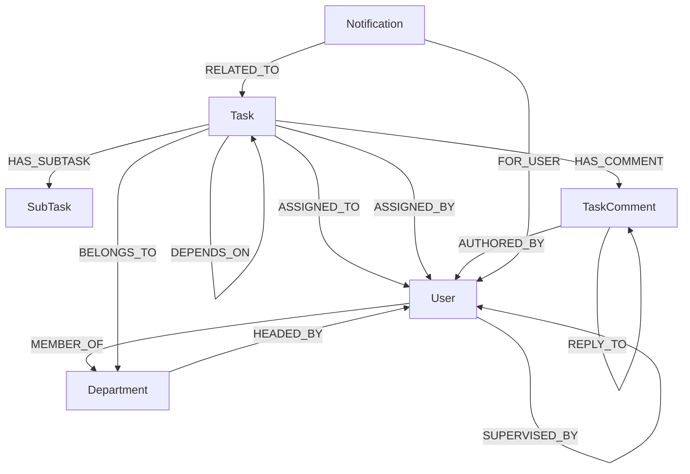

# TaskManager Pro (CognoDB Edition)

> A task and team management app, built with NestJS, Next.js 16, and CognoDB (a graph database that speaks openCypher over the Bolt protocol).

---

## Project Overview

TaskManager Pro is an internal task and workforce management system built On a graph database. It models reporting lines, task dependencies, departments, and performance scores as real connections in the graph, not as foreign keys in separate tables.

Regular task managers struggle with three things: reporting hierarchies that can be any number of levels deep, task dependency chains where one task blocks another, which blocks another and performance trailing and management. TaskManager Pro uses CognoDB to handle both with simple queries, no recursive SQL, and no background job needed to keep dependency checks up to date.

### Core Capabilities

- **Task dependencies:** Tasks can depend on other tasks (`Task -[:DEPENDS_ON]-> Task`), with a check that stops circular dependencies before they're created.
- **Blocker lookup:** See every task, at any depth, that's blocking a given task from starting.
- **Reporting chains:** Follow a staff member's management line up as many levels as it goes, in one query (`User -[:SUPERVISED_BY*1..10]-> User`).
- **Performance scoring:** Scores are calculated when you ask for them, from the current task data in the graph — not from a stored number a background job updates later.
- **Task comments:** Discussions on a task support nested replies (`TaskComment -[:REPLY_TO]-> TaskComment`).
- **UI:** Built with Next.js 16, Tailwind CSS v4, shadcn and vengeance ui components, and Framer Motion for animations.

---

## Why a Graph Database?

Part of this assignment was picking a problem where a graph database is a genuinely better fit than a relational one, not just a different way to store the same data. Two relationships in this app fit that description: they're self-referencing and can go arbitrarily deep, which is what graph databases are built for.

| Problem | In a relational database | In CognoDB |
|---|---|---|
| **Reporting chains** — how far up does an employee's management line go? | Not known in advance, so it's either a recursive query or fetching one manager at a time in a loop. | One line — `(u)-[:SUPERVISED_BY*1..10]->(m)` — returns the whole chain in one query. |
| **Task dependencies** — what's blocking this task, including what's blocking the things blocking it? | The tasks table joined to itself repeatedly, plus extra logic to stop things if a dependency loop was ever created by mistake. | Same idea, different relationship — `(t)-[:DEPENDS_ON*1..20]->(blocker)`. |
| **Stopping circular dependencies before they happen** | A database trigger, or pulling the whole dependency graph into the app to check by hand. | One query, run before saving: "does a path already exist going the other way?" |

---

## Graph Data Model

The app has 6 node types connected by 13 relationship types.

### Node Labels
- `User`: Team members, supervisors, and administrators.
- `Department`: Organizational divisions (e.g., Development, Operations).
- `Task`: Work units with status, priority, and deadlines.
- `SubTask`: Checklist items attached to a task.
- `TaskComment`: Threaded discussions on tasks.
- `Notification`: Activity alerts tied to tasks and users.

### Relationship Schema



---

## Key Cypher Queries

### 1. Multi-Hop Traversal (Employee Reporting Line)
Follows a staff member up through their managers, however many levels that takes:
```cypher
MATCH path = (u:User {id: $userId})-[:SUPERVISED_BY*1..10]->(manager:User)
RETURN manager.id AS id,
       manager.firstName AS firstName,
       manager.lastName AS lastName,
       manager.role AS role,
       length(path) AS depth
ORDER BY depth ASC
```

### 2. Transitive Blocker Resolution (Relational-Awkward Query)
Finds every task, at any depth, that's currently blocking a given task:
```cypher
MATCH (t:Task {id: $taskId})-[:DEPENDS_ON*1..20]->(blocker:Task)
OPTIONAL MATCH (blocker)-[:ASSIGNED_TO]->(assignee:User)
RETURN DISTINCT blocker.id AS id,
       blocker.title AS title,
       blocker.status AS status,
       blocker.deadline AS deadline,
       assignee.firstName + ' ' + assignee.lastName AS assignedToName
```

### 3. Circular Dependency Guard
Runs before a new `DEPENDS_ON` link is saved, to catch a loop (task A depending on task B depending on task A) before it can exist:
```cypher
MATCH (wouldBeDep:Task {id: $dependsOnTaskId})-[:DEPENDS_ON*1..20]->(t:Task {id: $taskId})
RETURN count(t) AS cycleCount
```

### 4. Performance Data
Pulls the raw task counts for one user in a single query. The score itself — weighted bonuses and penalties, 0 to 100 — is then worked out from these numbers in the backend code. Keeping that math in TypeScript instead of Cypher makes it easier to test and change later.
```cypher
MATCH (u:User {id: $userId})
OPTIONAL MATCH (t:Task)-[:ASSIGNED_TO]->(u)
WITH u,
     count(t) AS totalAssigned,
     count(CASE WHEN t.status = 'completed' THEN 1 END) AS onTime,
     count(CASE WHEN t.status = 'completed_late' THEN 1 END) AS completedLate,
     count(CASE WHEN t.status = 'overdue' THEN 1 END) AS overdue
RETURN u.id AS userId,
       totalAssigned,
       onTime,
       completedLate,
       overdue,
       onTime + completedLate AS tasksCompleted
```

---

## System Architecture

```
                                  ┌───────────────────────────────┐
                                  │      Client Web Browser       │
                                  │ (Next.js 16 + TanStack Query) │
                                  └──────────────┬────────────────┘
                                                 │ HTTP / REST / JWT
                                                 ▼
                                  ┌───────────────────────────────┐
                                  │         NestJS Backend        │
                                  │   (REST API + Global Guards)  │
                                  └──────────────┬────────────────┘
                                                 │ Bolt Protocol (bolt+s://)
                                                 ▼
                                  ┌───────────────────────────────┐
                                  │         CognoDB Cloud         │
                                  │   (openCypher Graph Engine)   │
                                  └───────────────────────────────┘
```

- **Backend (NestJS):** Organized into modules by feature (`auth`, `users`, `departments`, `tasks`, `performance`, `notifications`). One shared `Neo4jService` handles the database connection. Every query uses parameters instead of building the query as a string, which avoids Cypher injection.
- **Frontend (Next.js 16):** Built with the App Router, TanStack Query v5 for fetching and caching data, Tailwind CSS v4 for styling, and Framer Motion for animations.

---

## Application Pages & Features

| Page Route | Description |
|---|---|
| **`/` (Landing Page)** | Public landing page with an animated hero section and a grid showing the app's main features: dependency graph, performance scores, notifications, departments, and task status. |
| **`/login`** | Login page for staff accounts. |
| **`/dashboard`** | Main overview: completion rates, status breakdown, weekly activity, and top performers. |
| **`/dashboard/tasks`** | Task management grid with priority filters, search, sub-task checklists, a dependency viewer, a blockers panel, and threaded comments. |
| **`/dashboard/supervisors`** | Supervisor list with team stats, a team-member view per supervisor, and a tool to reassign team members. |
| **`/dashboard/departments`** | Department cards showing completion rates, member lists, and department head assignment. |
| **`/dashboard/staff`** | Staff management table: change roles, activate/deactivate accounts, and view a person's full reporting chain. |
| **`/dashboard/performance`** | Charts and tables for team performance, plus a breakdown of each person's score. |
| **`/dashboard/notifications`** | Alert feed with severity indicators and read/unread state. |

---

## Development Phases & Workflow

The project was built in four phases:

```
┌────────────────────────────────┐       ┌────────────────────────────────┐
│  Phase 1: Backend Foundation   │ ────► │  Phase 2: Backend Completion   │
│  • CognoDB connection layer    │       │  • Threaded comments           │
│  • JWT auth & seed bootstrap   │       │  • On-read performance scoring │
│  • Users, depts & tasks graph  │       │  • In-app notifications        │
└────────────────────────────────┘       └────────────────────────────────┘
                                                         │
                                                         ▼
┌────────────────────────────────┐       ┌────────────────────────────────┐
│  Phase 4: Polish               │ ◄──── │  Phase 3: Frontend Web App     │
│  • Feature overview grid       │       │  • Next.js 16 App Router UI    │
│  • Animations                  │       │  • TanStack Query data layer   │
│  • General performance pass    │       │  • Responsive dashboard pages  │
└────────────────────────────────┘       └────────────────────────────────┘
```

### End-to-End Workflow Process
1. **Account setup:** The super admin sets up the system and creates departments and staff accounts.
2. **Task creation:** A supervisor, admin or super admin creates a task, assigns it to a team member, and links any tasks it depends on.
3. **Blocker check:** The system checks for unfinished dependencies. If any exist, the task is marked as not ready to start.
4. **Execution:** Staff work through sub-task checklists and discuss progress in threaded comments.
5. **Score updates:** Performance scores reflect the latest task data as soon as you ask for them — there's no background job to wait for.

---

## User Roles & Permissions

| Action | Super Admin | Admin | Supervisor | Staff |
|---|:---:|:---:|:---:|:---:|
| **Manage Departments** | ✅ | ✅ | ❌ | ❌ |
| **Create & Manage Users** | ✅ | ✅ | ❌ | ❌ |
| **Reassign Supervisor Teams** | ✅ | ✅ | ❌ | ❌ |
| **Create & Assign Tasks** | ✅ | ✅ | ✅ (Own team) | ❌ |
| **Set Task Dependencies** | ✅ | ✅ | ✅ | ❌ |
| **Update Task Status** | ✅ | ✅ | ✅ | ✅ (Own tasks) |
| **Manage Sub-tasks & Comments** | ✅ | ✅ | ✅ | ✅ (Own tasks) |
| **View Organization Analytics** | ✅ | ✅ | ✅ (Team only) | ❌ (Own only) |

---

## Default & Demo Credentials

When the backend starts against an empty CognoDB database, it automatically creates the root super admin account. Running `npm run seed` adds demo departments, supervisors, staff, dependency chains, and comments.

### Seeded Demo Accounts (All passwords: `Password123!`)

| Role | Name | Email | Department |
|---|---|---|---|
| **Super Admin** | Ada Okoro | `ada.okoro@org.com` | Executive Management |
| **Supervisor** | Femi Balogun | `femi.balogun@org.com` | Development |
| **Supervisor** | Chidinma Eze | `chidinma.eze@org.com` | Operations |
| **Staff** | Tunde Alabi | `tunde.alabi@org.com` | Development (Reports to Femi) |
| **Staff** | Zainab Bello | `zainab.bello@org.com` | Development (Reports to Femi) |
| **Staff** | Ifeoma Nwosu | `ifeoma.nwosu@org.com` | Operations (Reports to Chidinma) |

### Bootstrap Fallback Super Admin (Configurable in `.env`)
- **Email:** `admin@org.com`
- **Password:** `AdminPassword123!`

---

## Setup & Installation Guide

### Prerequisites
- **Node.js:** v20.x or higher
- **npm:** v10.x or higher

---

### Step 1: Create a CognoDB Instance

1. Go to [console.cognodb.com](https://console.cognodb.com) and sign up. The free tier doesn't need a credit card.
2. Create a new instance and pick the free **c0** size.
3. Once created and running click on the connect button and copy the connection URI (it looks like `bolt+s://<instance-id>.databases.cognodb.cloud`) and the password.

---
 
### Step 2: Backend Setup

1. Navigate to the backend directory:
   ```bash
   cd backend
   ```

2. Install dependencies:
   ```bash
   npm install
   ```

3. Create your `.env` file:
   ```env
   PORT=3000
   FRONTEND_URL=http://localhost:3001
   JWT_SECRET=supersecretjwtkey_replace_in_production
   JWT_EXPIRES_IN=7d

   # CognoDB Cloud Connection
   COGNODB_URI=bolt+s://<your-instance-id>.databases.cognodb.cloud
   COGNODB_USER=cognodb
   COGNODB_PASSWORD=<your-generated-password>

   # Super Admin Bootstrap (Created automatically if DB is empty)
   SUPER_ADMIN_EMAIL=admin@org.com
   SUPER_ADMIN_PASSWORD=AdminPassword123!
   ```

4. Add sample data (optional):
   ```bash
   npm run seed
   ```

5. Start the backend:
   ```bash
   npm run start:dev
   ```
   *The backend runs at `http://localhost:3000`.*

---

### Step 3: Frontend Setup

1. Open a new terminal and navigate to the frontend directory:
   ```bash
   cd frontend
   ```

2. Install dependencies:
   ```bash
   npm install
   ```

3. Create your `.env.local` file:
   ```env
   NEXT_PUBLIC_API_URL=http://localhost:3000
   ```

4. Start the frontend:
   ```bash
   npm run dev
   ```
   *The web app runs at `http://localhost:3001` (or `http://localhost:3000` if the backend isn't running on 3000).*

---

## License

This project is submitted for the **Wexa AI Candidate Take-Home Assessment**. Built by Adebowale Ademuyiwa.