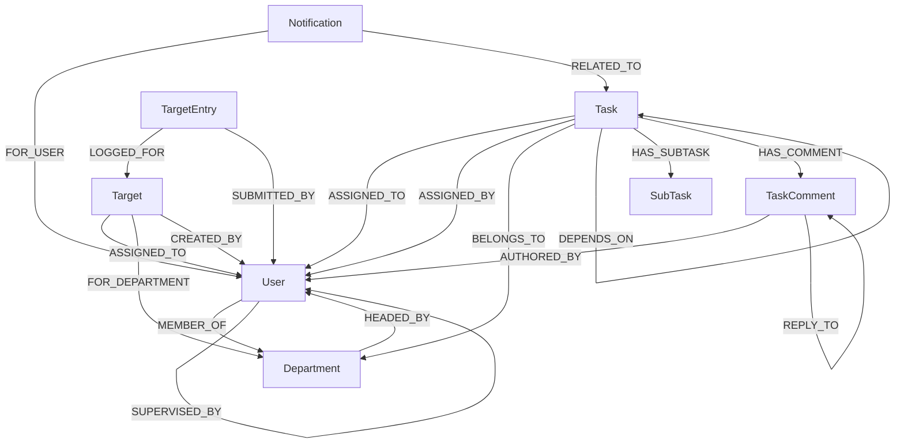

# TaskManager Pro (CognoDB Edition) — Technical Documentation

> **Application Type:** Full-Stack Enterprise Task Management System  
> **Database:** CognoDB (Managed openCypher Graph Database via Bolt Protocol)  
> **Backend:** NestJS (TypeScript) + Official Neo4j JavaScript Driver  
> **Frontend:** Next.js 16 (App Router), Tailwind CSS v4, Framer Motion, TanStack Query v5, shadcn/ui  

---

## 1. Executive Summary & Use Case

TaskManager Pro is an enterprise task and team management system built on top of **CognoDB**. It models organizational hierarchies, transitive task dependencies, departmental boundaries, targets, and live performance metrics as native graph structures.

### Why a Graph Database?

Traditional relational databases struggle with recursive and multi-hop structures. TaskManager Pro leverages graph database capabilities for two core operational patterns:

1. **Arbitrary-Depth Reporting Lines (Multi-hop Traversal):**
   Organizational reporting chains (`User -[:SUPERVISED_BY]-> User`) vary in depth. In SQL, resolving an employee's full hierarchy requires recursive Common Table Expressions (CTEs) or multiple round trips. In CognoDB, it is a single bounded pattern match:
   ```cypher
   MATCH path = (u:User {id: $userId})-[:SUPERVISED_BY*1..10]->(manager:User)
   RETURN manager, length(path) AS depth ORDER BY depth
   ```

2. **Transitive Task Dependency Resolution (Relational-Awkward Queries):**
   When Task A depends on Task B, which depends on Task C, determining if Task A is truly ready to start requires traversing transitive blockers while guarding against circular dependencies. In Cypher:
   ```cypher
   MATCH (t:Task {id: $taskId})-[:DEPENDS_ON*1..20]->(blocker:Task)
   RETURN DISTINCT blocker
   ```
   Cycle detection before edge creation is executed natively in Cypher before writing the relationship.

3. **On-Read Real-Time Performance Analytics:**
   Rather than maintaining brittle cron jobs and denormalized score tables, performance scores are derived dynamically from active task assignments and completion states directly via graph aggregations.

---

## 2. System Architecture

```
                                  ┌───────────────────────────────┐
                                  │      Client Web Browser       │
                                  │ (Next.js 16 + TanStack Query) │
                                  └──────────────┬────────────────┘
                                                 │ HTTP / REST / JWT
                                                 ▼
                                  ┌───────────────────────────────┐
                                  │         NestJS Backend        │
                                  │   (REST API + Global Guards)  │
                                  └──────────────┬────────────────┘
                                                 │ Bolt Protocol (bolt+s://)
                                                 ▼
                                  ┌───────────────────────────────┐
                                  │         CognoDB Cloud         │
                                  │   (openCypher Graph Engine)   │
                                  └───────────────────────────────┘
```

### Backend Architecture (NestJS)
- **Modularity:** Organized by domain (`auth`, `users`, `departments`, `tasks`, `targets`, `performance`, `notifications`).
- **Connection Management:** Global `Neo4jService` handles connection lifecycle via the official `neo4j-driver`, enforcing parameterised queries and mapping integer/node records to clean JSON.
- **Security & Authorization:** Passport-JWT authentication strategy, `JwtAuthGuard`, and granular role-based access control with `@Roles(...)` and `RolesGuard` (`super_admin`, `admin`, `supervisor`, `staff`).
- **Response Standardization:** Global `ResponseInterceptor` envelops payloads in a standard `{ success, statusCode, message, data }` format.

### Frontend Architecture (Next.js 16)
- **App Router:** Fully separated public marketing routes (`/`, `/login`) and authenticated workspace routes (`/dashboard/*`).
- **State & Caching:** TanStack Query v5 manages server state, optimistic mutations, and automated cache invalidation.
- **UI Design System:** Custom theme engine built on Tailwind CSS v4 and OKLCH color spaces, dark/light system mode switching, and accessible primitives.
- **Animations:** Framer Motion for interactive micro-animations and page transitions; GPU-accelerated CSS keyframes for background visuals.

---

## 3. Graph Data Model

### Node Labels
- `User`: Team members, supervisors, and administrators.
- `Department`: Organizational divisions.
- `Task`: Assignable work items with priority, status, and deadlines.
- `SubTask`: Checklist items linked to parent tasks.
- `TaskComment`: Threaded discussion entries.
- `Target`: Goal metrics (individual or departmental).
- `TargetEntry`: Progress logs contributing to a target.
- `Notification`: Activity alerts linked to tasks and users.

### Graph Relationship Schema



---

## 4. Key Cypher Queries

### 1. Multi-Hop Traversal (Reporting Chain)
Traverses upwards from any staff member to the executive root:
```cypher
MATCH path = (u:User {id: $userId})-[:SUPERVISED_BY*1..10]->(manager:User)
RETURN manager.id AS id,
       manager.firstName AS firstName,
       manager.lastName AS lastName,
       manager.role AS role,
       length(path) AS depth
ORDER BY depth ASC
```

### 2. Transitive Blockers Resolution
Retrieves all upstream dependencies blocking a task:
```cypher
MATCH (t:Task {id: $taskId})-[:DEPENDS_ON*1..20]->(blocker:Task)
OPTIONAL MATCH (blocker)-[:ASSIGNED_TO]->(assignee:User)
RETURN DISTINCT blocker.id AS id,
       blocker.title AS title,
       blocker.status AS status,
       blocker.deadline AS deadline,
       assignee.firstName + ' ' + assignee.lastName AS assignedToName
```

### 3. Circular Dependency Guard
Executed prior to creating a `DEPENDS_ON` relationship to prevent graph deadlocks:
```cypher
MATCH (wouldBeDep:Task {id: $dependsOnTaskId})-[:DEPENDS_ON*1..20]->(t:Task {id: $taskId})
RETURN count(t) AS cycleCount
```

### 4. 2-Hop Department Target Discovery
Retrieves team targets for a user's department without manual foreign key joins:
```cypher
MATCH (u:User {id: $userId})-[:MEMBER_OF]->(d:Department)<-[:FOR_DEPARTMENT]-(t:Target)
RETURN t, d.name AS departmentName
```

---

## 5. API Reference Summary

All routes are prefixed with `/api`. Authenticated endpoints require `Authorization: Bearer <token>`.

| Module | Method | Endpoint | Access | Purpose |
|---|---|---|---|---|
| **Auth** | `POST` | `/auth/login` | Public | Authenticate user & issue JWT |
| | `GET` | `/auth/me` | Authenticated | Retrieve authenticated user profile |
| | `PUT` | `/auth/change-password` | Authenticated | Update user password |
| **Users** | `GET` | `/users` | Authenticated | List team members with department/supervisor |
| | `POST` | `/users` | Admin / Super Admin | Create user account |
| | `GET` | `/users/:id/reporting-chain` | Authenticated | Multi-hop reporting path to top management |
| | `GET` | `/users/:id/team` | Supervisor / Admin | Direct reports of a supervisor |
| | `PATCH` | `/users/:id/status` | Admin / Super Admin | Toggle active/inactive status |
| | `PATCH` | `/users/reassign-supervisor`| Admin / Super Admin | Reassign supervisor for team members |
| **Departments** | `GET` | `/departments` | Authenticated | List departments with staff and completion metrics |
| | `POST` | `/departments` | Admin / Super Admin | Create a new department |
| | `PUT` | `/departments/:id` | Admin / Super Admin | Update department name, description, or head |
| | `DELETE`| `/departments/:id` | Admin / Super Admin | Delete department (blocked if staff assigned) |
| **Tasks** | `GET` | `/tasks` | Authenticated | List filtered tasks (by status, priority, dept) |
| | `POST` | `/tasks` | Supervisor / Admin | Create task with assignees & initial dependencies |
| | `PATCH` | `/tasks/:id/status` | Authenticated | Update status (auto-computes completion time) |
| | `POST` | `/tasks/:id/dependencies` | Supervisor / Admin | Link task dependency with cycle guard |
| | `DELETE`| `/tasks/:id/dependencies/:depId` | Supervisor / Admin | Remove task dependency |
| | `GET` | `/tasks/:id/blockers` | Authenticated | Transitive blockers list |
| | `GET` | `/tasks/:id/ready` | Authenticated | Check if all blockers are completed |
| | `POST` | `/tasks/:id/subtasks` | Authenticated | Add checklist sub-task |
| | `POST` | `/tasks/:id/comments` | Authenticated | Add threaded comment or reply |
| **Targets** | `GET` | `/targets` | Authenticated | List individual and departmental targets |
| | `POST` | `/targets` | Supervisor / Admin | Create new target |
| | `POST` | `/targets/:id/entries` | Authenticated | Log numeric progress entry |
| **Performance** | `GET` | `/performance` | Supervisor / Admin | Team-wide performance ranking & metrics |
| | `GET` | `/performance/me` | Authenticated | Individual user performance breakdown |
| **Notifications**| `GET` | `/notifications` | Authenticated | User activity and alert stream |
| | `PATCH` | `/notifications/:id/read` | Authenticated | Mark alert as read |

---

## 6. Frontend Pages & Navigation

| Route | Page | Purpose |
|---|---|---|
| `/` | **Landing Page** | Product overview, animated Hero with `FlipFadeText`, 5-card `TaskBentoGrid`, and architecture highlights |
| `/login` | **Authentication** | Secure credentials login with interactive node canvas |
| `/dashboard` | **Overview** | High-level metrics, completion rates, top performers, weekly trends |
| `/dashboard/tasks` | **Tasks Board** | Data table, status filtering, dependency visualizer, sub-tasks checklist, threaded comments sheet |
| `/dashboard/supervisors` | **Supervisors** | Supervisor cards, team roster sheets, selective team member reassignment |
| `/dashboard/departments` | **Departments** | Department cards, member breakdown, completion statistics, department head assignments |
| `/dashboard/staff` | **Staff Directory** | User administration, role management, reporting line view, status toggle |
| `/dashboard/targets` | **Targets** | Goal cards, progress logging sheets, timeline entries |
| `/dashboard/performance`| **Analytics** | Performance distribution charts, ranking tables, score breakdown |
| `/dashboard/notifications`| **Alerts** | Notification center with severity indicators and read state management |

---

## 7. Setup & Development Guide

### Prerequisites
- **Node.js:** v20.x or higher
- **npm:** v10.x or higher
- **CognoDB Instance:** Cloud database URL (`bolt+s://...`) and authentication credentials from [console.cognodb.com](https://console.cognodb.com).

### Environment Configuration

#### Backend (`backend/.env`)
```env
PORT=3000
FRONTEND_URL=http://localhost:3001
JWT_SECRET=your-secure-jwt-secret-key-here
JWT_EXPIRES_IN=7d

# CognoDB Connection
COGNODB_URI=bolt+s://<instance-id>.databases.cognodb.cloud
COGNODB_USER=cognodb
COGNODB_PASSWORD=<your-generated-password>

# Super Admin Seed (Created automatically at startup if database is empty)
SUPER_ADMIN_EMAIL=admin@org.com
SUPER_ADMIN_PASSWORD=AdminPassword123!
```

#### Frontend (`frontend/.env.local`)
```env
NEXT_PUBLIC_API_URL=http://localhost:3000
```

### Installation & Execution

#### 1. Start Backend
```bash
cd backend
npm install
npm run seed       # Optional: populate sample departments, users, and task chains
npm run start:dev  # Starts backend server at http://localhost:3000
```

#### 2. Start Frontend
```bash
cd frontend
npm install
npm run dev        # Starts Next.js app at http://localhost:3001
```

---

## 8. Deployment Architecture

| Component | Target Platform | Build Command | Output / Port |
|---|---|---|---|
| **Backend API** | Render / Railway / Docker | `npm run build` | `dist/main.js` (Port 3000) |
| **Frontend Web** | Vercel / Netlify | `npm run build` | Next.js Production Build |
| **Database** | CognoDB Cloud | Managed Service | Bolt Port 7687 |
